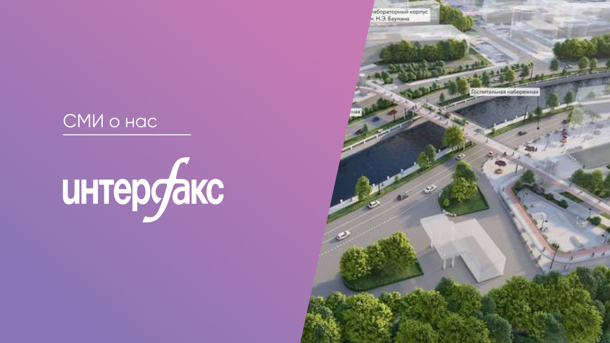

# Мост, о котором ты мечтал

> «Привет, бауманцы! Нас ждут перемены! Друзья, на наших глазах на Яузе разрастается Бауманская технологическая долина с новыми корпусами, большими территориями и крутым досугом! Несмотря на то что инициативная группа уже работает, каждый может привнести свои идеи в создание Бауманского кампуса!» — восторженно пишет он в первой публикации.

К концу 2023 года планируется достроить новый бауманский кампус — огромный научно-учебный кластер на берегу Яузы. Для связи учебных корпусов с общежитиями будет построен мост, о котором мечтал, пожалуй, каждый бауманец. Дойти от учебно-лабораторного корпуса до новых общежитий и спортивного комплекса можно будет напрямую.

> «Новый мост соединит две части нового образовательного кластера Бауманки. Примерно в 300 метрах от места строительства уже есть два моста. Но Госпитальный мост — скорее, автомобильный, на нем довольно длинные интервалы переключения светофоров, а Рубцов мост неудобен для родителей с колясками и маломобильных групп. Также новый мост сделает более комфортным подход к стадиону и спортивному клубу на левом берегу Яузы»,
> — отметил главный архитектор Москвы Сергей Кузнецов.

Особенностью моста станут общественные пространства, интегрированные в конструкцию. Так по проекту здесь будет реализована идея с пространством для отдыха и учебы на мосту и скейтпарком, встроенным в само сооружение. Протяженность моста составит 100 метров, ширина - 7,5 метра.

Подробнее читайте в [источнике](https://www.interfax-russia.ru/moscow/news/most-cherez-yauzu-postroyat-na-territorii-baumanki).

