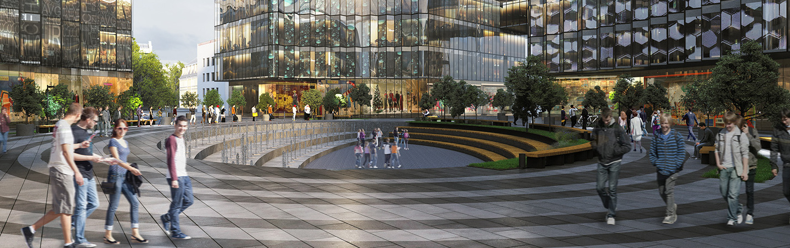

# Строения с панорамным остеклением фасадов

Два четырехэтажных корпуса, построенных в составе кампуса МГТУ имени Н.Э. Баумана, станут первыми объектами нового научно-исследовательского кластера университета и обеспечат учреждение современными лабораторными площадками. Об этом сообщил заместитель Мэра Москвы в Правительстве Москвы по вопросам градостроительной политики и строительства Андрей Бочкарёв.

«В зданиях общей площадью 5,3 тысячи квадратных метров уже в ближайшее время начнут работать Инжиниринговый центр наземных транспортно-технологических систем и Центр биомедицинских систем и технологий. Учебные аудитории сдаются с отделкой и установленным технологическим лабораторным оборудованием», - рассказал Андрей Бочкарёв.

Два четырехэтажных строения с панорамным остеклением фасадов стали центром композиции площади между Бригадирским переулком и Бауманской улицей. На прилегающей территории обустроены тротуары, клумбы, установлено наружное освещение и малые архитектурные формы.

«Проект по созданию университетского квартала является уникальным не только для Москвы, но и для всей страны. Всего здесь будет построено 14 зданий общей площадью порядка 170 тысяч квадратных метров», - пояснил Андрей Бочкарев.

Он отметил, что строительство университетского квартала продолжается в соответствии с запланированными темпами.

«После завершения работ по возведению инжинирингового и биомедицинского центров по результатам комплексной проверки Мосгосстройнадзор подтвердил соответствие построенных объектов проектной документации, а затем выдал разрешение на его ввод в эксплуатацию», - рассказал председатель Мосгосстройнадзора Игорь Войстратенко. 

Он отметил, что в двух схожих по архитектуре и планировке зданиях предусматривается размещение научных и учебных лабораторий, кафедр факультета, учебных аудиторий, а также зон для инженерно-технического персонала.

Вчера Мэр Москвы Сергей Собянин открыл новые корпуса научно-исследовательского кластера МГТУ им. Баумана.

«По поручению президента Российской Федерации совместно с правительством России мы реализуем масштабный проект обновления материальной базы одного из старейших технических университетов нашей страны. Здесь создается 14 новых корпусов - практически везде одновременно ведутся большие работы. Сегодня сдаем два корпуса. Это биотехнологический центр и центр транспортного инжиниринга. Остальные корпуса будут построены в соответствии с графиком и сданы в 2023 и 2024 году. «Бауманка» получит новые лабораторные, образовательные корпуса и комфортные общежития для студентов», - сказал Собянин. 
