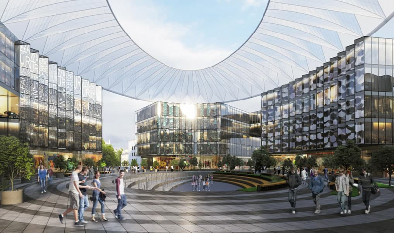

# Кампус 3

При этом все москвоведческое сообщество стоит на ушах: прямо сейчас на этой территории сносят целый исторический квартал, среди утраченных зданий, например, казарменный корпус памятника федерального значения Фанагорийских казарм, левое крыло основного здания, в котором располагались училищная домовая церковь Св. Александра Невского и училище Петра Ольденбургского. Активисты «Архнадзора» становятся под бульдозеры, чтобы остановить снос, но очевидно, что это бесполезно — снесенные здания уже не спасти, но хотя бы можно высказать свое несогласие с происходящим.

