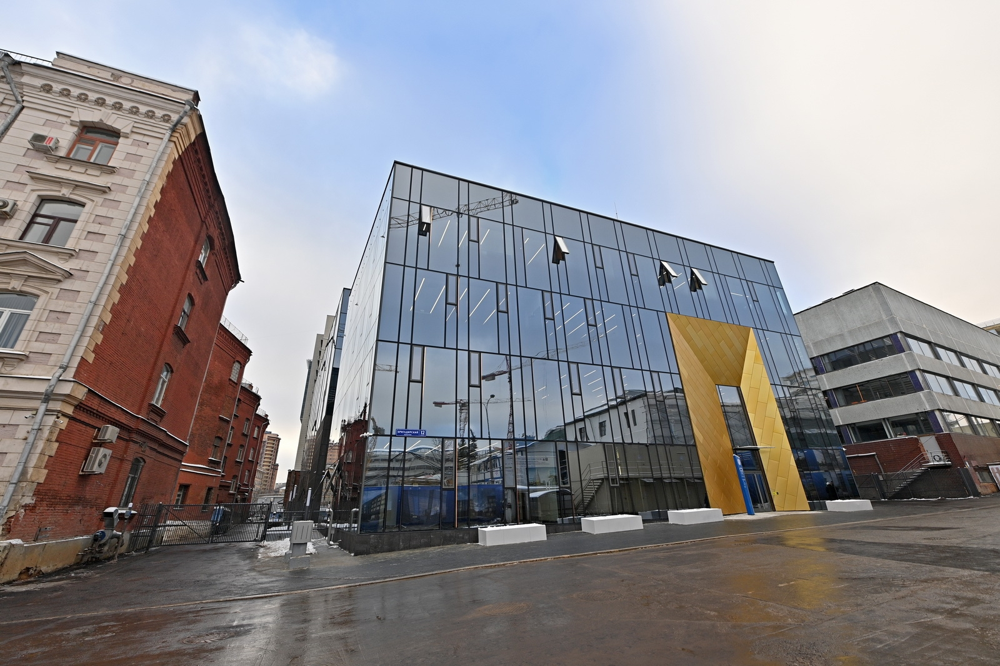

# Центр биомедицинских систем и технологий

​Мэр столицы Сергей Собянин и заместитель председателя правительства РФ Дмитрий Чернышенко открыли новые корпуса научно-исследовательского кластера Московского государственного технического университета (МГТУ) имени Баумана.

При этом все москвоведческое сообщество стоит на ушах: прямо сейчас на этой территории сносят целый исторический квартал, среди утраченных зданий, например, казарменный корпус памятника федерального значения Фанагорийских казарм, левое крыло основного здания, в котором располагались училищная домовая церковь Св. Александра Невского и училище Петра Ольденбургского. Активисты «Архнадзора» становятся под бульдозеры, чтобы остановить снос, но очевидно, что это бесполезно — снесенные здания уже не спасти, но хотя бы можно высказать свое несогласие с происходящим.

«По поручению президента Российской Федерации совместно с правительством России мы реализуем масштабный проект обновления материальной базы одного из старейших технических университетов нашей страны. Здесь создается 14 новых корпусов – практически везде одновременно ведутся большие работы. Сегодня сдаем два из них – это биотехнологический центр и центр транспортного инжиниринга. Остальные будут построены в соответствии с графиком и сданы в 2023 и 2024 годах. «Бауманка» получит новые лабораторные, образовательные корпуса и комфортные общежития для студентов», – сказал Сергей Собянин, передает АГН «Москва».